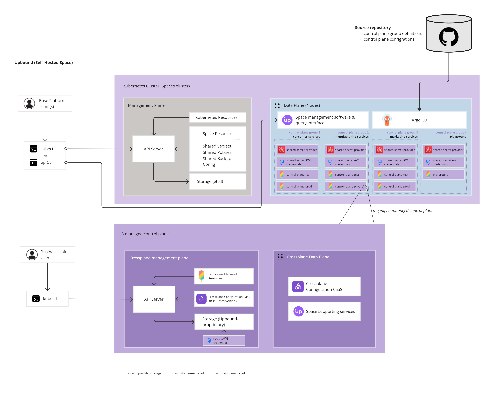

# Upbound Self-Hosted Spaces reference architecture

This repository contains a reference implementation for deploying Crossplane at scale with Upbound self-hosted Spaces. 

## Repository tour

This repository is a reference architecture for deploying an Upbound self-hosted Space to serve three business units: a consumers services business unit, a manufacturing services business unit, and a marketing business unit. 

Each business unit operates their own app teams, deploying software and infrastructure for their line of business. Each business unit deploys software into `test` and `prod` environments. This platform deploys a managed control plane mapping to a cloud account boundary. This reference architectures deploys a control plane group for each business unit, and then 2 control planes for each test and prod software environment. The result is 6 managed control planes, plus a seventh "sandbox" control plane which all business units can use for a sandbox environment.



### Repository layout

The repository is composed of three folders:

1. **bootstrap:** This folder contains the manifests to configure Argo CD to sync desired control plane infrastructure and configure each control plane, driven from Git.
2. **infrastructure:** This folder contains the declaration of the desired runtime configuration of each managed control plane along with the desired external secrets to be synchronized onto each control plane.
3. **configuration:** This folder contains the desired Crossplane configurations of each control plane.

In each of these three root folders, the resources are grouped together based on the business unit (3 groups, plus a sandbox group).

## Guide

### Prerequisites

This project requires the following:

* You've deployed Upbound self-hosted Spaces (deployed into your preferred Kubernetes cluster). When deploying the Space, make sure to enable the [on cluster Argo CD plugin](https://docs.upbound.io/spaces/use-argo-flux/#on-cluster-argo-cd).
* You've deployed Argo CD on the same cluster.

### Setup

1. Clone this repository to your machine.
2. Deploy a self-hosted Upbound Space using the [documentation](https://docs.upbound.io/spaces/quickstart/azure-deploy/). **Make sure to include the argocd plugin optional alpha feature in the `up space init ...` command as linked in the preceding section.**
3. Deploy Argo CD into the same hosting Kubernetes cluster following [Argo CD documentation](https://argo-cd.readthedocs.io/en/stable/getting_started/)
4. Configure Argo CD after installation by editing the ConfigMap `argocd-cm` in the `argocd` namespace:

```yaml
apiVersion: v1
kind: ConfigMap
data:
  resource.exclusions: |
    - apiGroups:
      - "*"
      kinds:
      - "*"
      clusters:
      - "controlplane-*"
  resource.inclusions: |
    - apiGroups:
      - "*"
      kinds:
      - ControlPlane
      - Provider
      - Configuration
      - Application
      clusters:
      - "*"
```

5. Deploy the Applications contained in the `bootstrap` folder:

```bash
kubectl apply -f bootstrap/
```

6. Synchronize Argo.

### Configure connection to secret store

This reference architecture is configured to synchronize external secrets from AWS Secret Manager. This allows you to store the `ProviderConfigs` of each control plane in a central keystore and push them onto your control plane securely. Because of this, the `SharedSecretStore` objects created in each control plane group use `awssm` as the provider.

You're encourage to configure the `SharedSecretStores` with another provider if you like. Otherwise, you should create a secret in the Space to enable each `SharedSecretStore` to access AWS Secret Manager. For simplicity, this could be providing account credentials for an AWS account with the necessary access:

```yaml
kubectl create secret generic aws-access-secret -n consumer-services --from-literal=access-key=<AWS-account-key> --from-literal=secret-access-key=<AWS-account-secret>
kubectl create secret generic aws-access-secret -n manufacturing-services --from-literal=access-key=<AWS-account-key> --from-literal=secret-access-key=<AWS-account-secret>
kubectl create secret generic aws-access-secret -n marketing-services --from-literal=access-key=<AWS-account-key> --from-literal=secret-access-key=<AWS-account-secret>
kubectl create secret generic aws-access-secret -n playground --from-literal=access-key=<AWS-account-key> --from-literal=secret-access-key=<AWS-account-secret>
```

Each `SharedExternalSecret` looks for the provider config credentials to be in the form of:

* **secret name:** providerconfig-creds-prod
* **secret key-values** [`secret-access-key`, `AWS-account-secret`]

For production scenario, you'd want to configure it to assume an IAM role instead.

### Configure Argo CD

Step 4 of the setup guide recommends you configure Argo CD to include or exclude resource groups and kinds. If you want Argo to sync different, additional resource types to your control planes--like for example, a custom XRD you built with Crossplane--you're encouraged to make additional edits to the Argo CD configuration. For example, here's how you'd have Argo sync `XDatabase` resource types to a control plane:

```yaml
apiVersion: v1
kind: ConfigMap
data:
  ...
  resource.inclusions: |
    - apiGroups:
      - "*"
      kinds:
      ...
      - XDatabase
      ...
      clusters:
      - "*"
```
